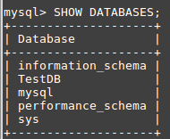

# Database-API-POC
A Python MySQL Database REST API Connection - Proof Of Concept

With this Python Script you can Acess MySQL directly via a REST Interface.

 
 

<h3>Comprisson:</h3>

**Native MySQL Call**

 

 

**API MySQL Call**

 

 
 

<h3>Configuration/Installation</h3>

- Install MySQL/MariaDB
- Add your DB credentials in **dbConnection.py**
- Install Python3.x
- sudo sh setup_py.sh
- sh start_server.sh
- Done

<h3>Test Connection</h3>

- Open TestApi.js
- Copy the Command you want to
- Open a Blank WebBrowser Tab
- Past the Command and Press Enter

 
 

<h3>Info</h3>

- Falcon was used to define the interface
- Gunicorn was used to run the Server

 
 

Since this is a POC, I have not implemented any security measures when accessing the SQL Server or protecting and monitoring a connection. 
Normally you would write functions that would call SQL commands and process the data. This would allow the connection of a client program via REST interface.
The implementation with program specific functions could look like this: